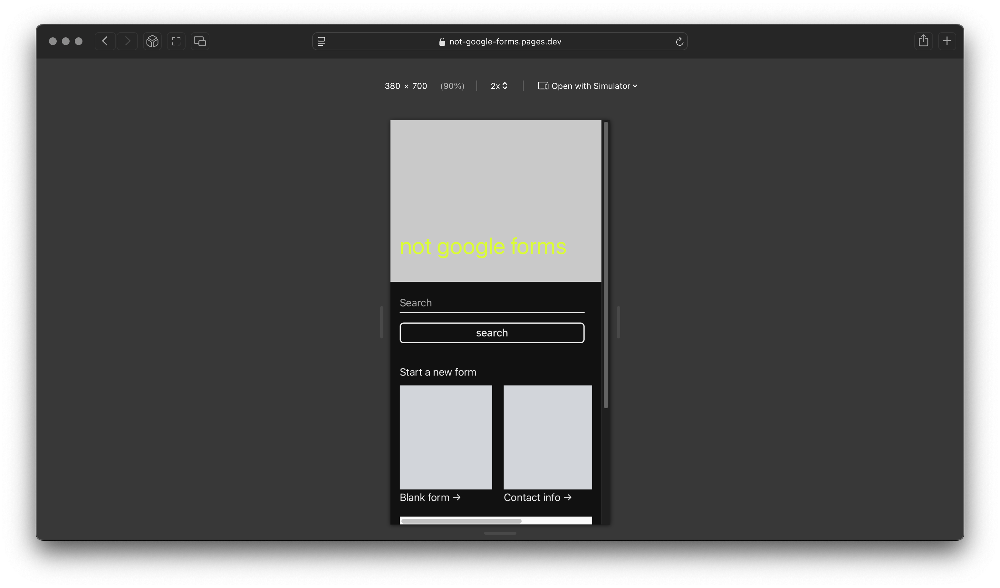

https://github.com/user-attachments/assets/35bcc9bf-019b-4874-beaa-ea9e980b274b

https://github.com/user-attachments/assets/4cf700b7-191d-49a0-a6ff-5d849c4eaf4b

https://github.com/user-attachments/assets/3e448179-370e-4e6a-885e-ae2b2efd0cf0

https://github.com/user-attachments/assets/f702bae3-ae6a-429d-bbf2-8725c3ba1575

Not Google forms

Deployment:
 [Cloudflare](https://not-google-forms.pages.dev)

 
 > **Note: **  I struggled with implementing user auth for this project. This was my first ever attempt doing auth and working with server side code but I tried, after many trial and error, I removed the user auth feature from the app, hardest part of the whole project honestly. For an image upload service feature, I checked out Cloudflare Images but it was a paid service, Imgix unfortunately not available in my country. 

 
Tech stack: 
1. html
2. css
3. tailwind
4. typescript
5. react
6. react router
7. vite
8. prettier
9. express
10. prisma
11. sqlite

I used native browser and node apis as much as possible to avoid dependencies. For example, I used tsc (typescript compiler) script both on client and server before starting a dev server, instead of adding ts-node, ... million other ts runner dependencies. On server, node --watch command replaced the need for nodemon and native .env support for dotenv. The whole project is built with Typescript and ESM modules.